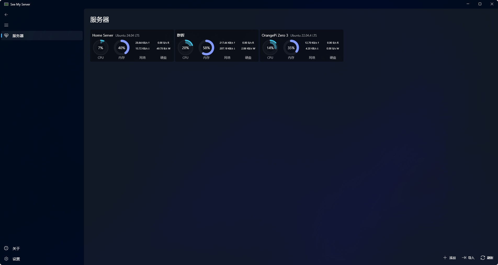

<p align="center">
  <h1 align="center">See My Server</h1>
  <p align="center">一款服务器监控软件，使用 WinUI3</p>
  <p align="center">
    <a href="https://github.com/SIXiaolong1117/SeeMyServer/blob/master/LICENSE">
      
    </a>
    <a href="https://github.com/SIXiaolong1117/SeeMyServer/releases">
      
    </a>
  </p>
  <p align="center">
    <a href="https://twitter.com/SI_Xiaolong">
      
    </a>
  </p>
</p>
<p align="center">
    
    <!--  -->
</p>

## ⬇下载/Download

### 从 Microsoft Store 获取（推荐）

[](https://www.microsoft.com/store/apps/9MTGBS9PTCH8)
<!-- ## ✋使用教程/Wiki

参考本项目[Wiki](https://about.sixiaolong.win/Project/Remote-Toolbox.html)。 -->

## 🛠️获取源码/Source Code

要构建此项目，您需要将项目源码克隆到本地。

您可以使用 Git 命令行：

```powershell
git clone https://github.com/SIXiaolong1117/SeeMyServer.git
```

或者更方便的，使用 Visual Studio 的“克隆存储库”克隆本仓库。

使用 Visual Studio 打开项目根目录的 `SeeMyServer.sln`，即可进行调试和打包。

## 我的其他项目

- [远程工具箱 (Remote Toolbox)](https://github.com/SIXiaolong1117/WinWoL)：一个集成网络唤醒、远程桌面 (RDP)、SSH指令/脚本的远程工具箱 (Remote Toolbox)，使用 WinUI3。
- [网关切换器 (Gateway Switcher)](https://github.com/SIXiaolong1117/NetworkSelector)：一个 Windows 网络配置切换器，可以在多个预设配置间快速切换，使用 WinUI3。
- [图片转 Base64（Pic to Base64）](https://github.com/SIXiaolong1117/vue-pictobase64)：一个图片转 Base64 编码的工具，使用 Vue + Electron。